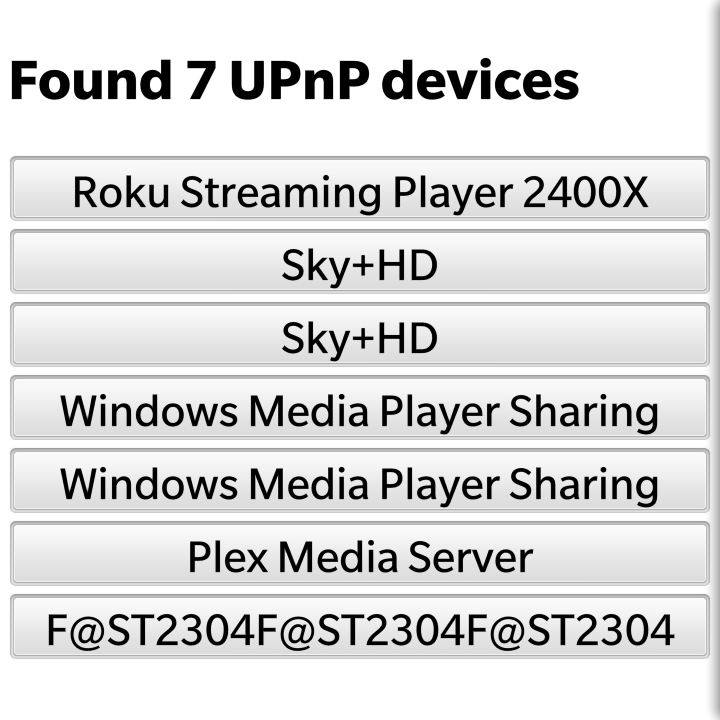
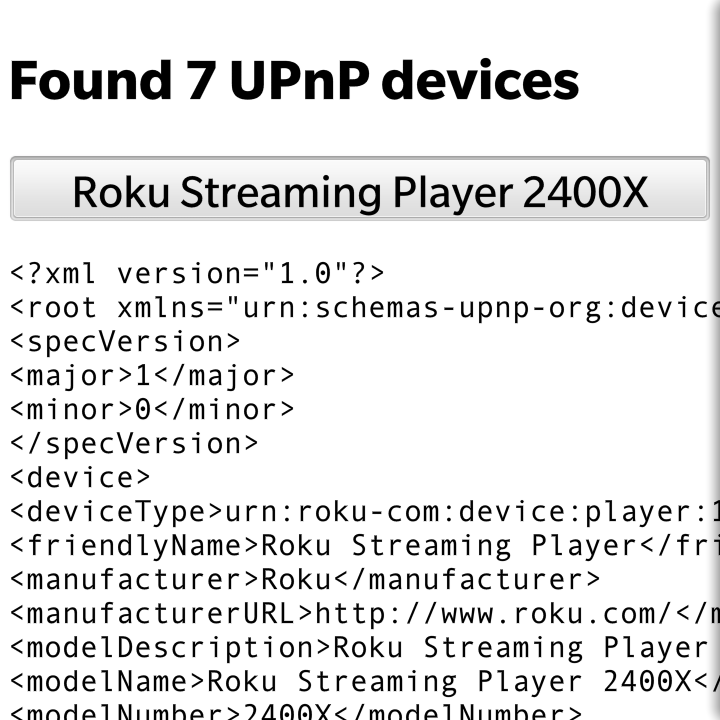

uPnP Extention
==============

This BlackBerry 10 WebWorks extension provides additional APIs supplying information about Universal Plug and Play devices available over WiFi.

** Tested On **

BlackBerry 10 Dev Alpha C 10.1.0.4828

BlackBerry 10 Dev Alpha C 10.2.0.1445

** Author **

[Peardox] (http://supportforums.blackberry.com/t5/user/viewprofilepage/user-id/325249)

## Building and Testing the Sample

1. Deploy the extension into your BB10 WebWorks SDK by copying the community.upnp folder from the ext folder to the Framework/ext folder in your WebWorks SDK, or run the Ant build script in the /ext folder to do so.
2. Package the sample in the sdtest folder. Use the [Ant Build Script](https://github.com/blackberry/BB10-WebWorks-Community-Samples/tree/master/Ant-Build-Script), or you can do this with the WebWorks packager command:
	__bbwp__ sdtest -g _signingpassword_
3. Load it on your phone using the Ant Build Script, or with the _blackberry-deploy_ command found in the dependencies/tools folder of your WebWorks SDK.
4. When the application runs, an informational page will be displayed as in the screenshots below.

 &nbsp;


## Including the feature in your application
Whenever you use the below feature id in any of your WebWorks applications this extension will be loaded for use.

Note that it is also required that you give your app the disabled websecurity feature. This is as the extension needs to talk to any and all uPnP devices on your WiFi network. The websecurity feature is a bit black and white in this respect, all or nothing...

```xml
	<feature id="blackberry.app">
		<param name="websecurity" value="disable" />
	</feature>
	<feature id="community.upnp" required="true" version="1.0.0.0" />
```

## The Extension API
The uPnP Extension provides the following API:

```javascript
	var result = community.upnp.discover(timeout [optional], devtype [optional]);
	
	/*
	Result is a javascript object with the following properties

	success,      	// [Bool] 	- Did it work?
	timeout,    	// [Int] 	- Timeout used
	devtype,  		// [String] - Device Type searched for
	devcount,  		// [Int] 	- Number of devices found
	device			// [Array] 	- An array of device objects
		url			// [String]	- Announce URL from attached device
		xml			// [String]	- XML documents returned from attached device
	*/
```

The parameters to discover are as follows...

timeout : How long to wait for a reply in ms (default - 1000)
devtype : Device type to search for (default - upnp:rootdevice). This is the ST field of the M-SEARCH query.


## Building the extension from source

Copy the extension folder to a location on your computer to start working with it.

### Momentics NDK setup

1. Open the Momentics IDE. Navigate to the workbench and from the program menu
select File -> Import and choose "Existing Projects into Workspace".
2. Choose "Select root directory: " and browse to the NDK_project directory where you copied the extension. Select the upnp project in the Projects list and uncheck "Copy projects into workspace". Click Finish.
3. Follow these next steps to build the extension to be sure the setup is working.

#### How to build your native Extension</a>

1. Right click your project and select the Clean Project option.
2. Right click your project again and select Build Configurations -> Build Selected... .
3. A window will appear that shows all the available build configurations
for the project. Select Device-Release and Simulator-Debug and click ok.
4. You should see the shared libraries generated in the folders for each Build Configuration that you selected.
5. Copy the .so file(s) to the device and simulator folders under the ext/community.upnp directory. Or you can use the Ant build script to do so.

### Copying the Extension to the SDK</a>

1. Under the ext folder in this project should be the community.upnp folder with the following file structure underneath it:


If you wish to do the copying manually, continue with these steps:

2. The device and simulator folders should contain the libupnp.so files built by the NDK.
3. Copy the community.upnp folder into your WebWorks SDK, placing it in the Framework/ext directory.

If you have Ant installed and would like to use the build script provided, edit the script as follows (you will find it in the /ext directory, called [build.xml](https://github.com/blackberry/WebWorks-Community-APIs/tree/master/BB10/upnp/ext/build.xml) ).

1. Change the project name to match the extension name in manifest.json.
2. Change the bbwp.native.dir value to match the SDK you want to deploy to.
3. Type ant at a command prompt while in the /ext directory of the Extension. 

The build script will clean any old extension from your SDK, copy the .so files build by the NDK into the correct locations, and finally copy the whole extension into the SDK.

### Using the Extension in an Application</a>

With the extension copied into your WebWorks SDK as explained above, you can use it in your applications by referencing it as a feature in your config.xml file. 

```xml
<feature id="community.upnp" />
```

All the methods in the extension will be prefixed by that feature id, so a method called discover() supplied in the community.upnp extension will be called in JavaScript like so:

```javascript
community.upnp.discover();
```

### Modifying the Extension

See the examples in the [Template Extension](https://github.com/blackberry/WebWorks-Community-APIs/blob/master/BB10/Template) for how to add additional features to this extension

#### Rebuild 
When making changes, rebuild regularly so you don't make a really hard to find typo.

Follow the steps above to:
1. [Build the native portion](#how-to-build-your-native-extension),
2. [Copy the extension to your SDK](#copying-the-extension-to-the-sdk), and
3. [Use the extension in your test app](#using-the-extension-in-an-application).


**To contribute code to this repository you must be [signed up as an official contributor](http://blackberry.github.com/howToContribute.html).**

## Disclaimer

THE SOFTWARE IS PROVIDED "AS IS", WITHOUT WARRANTY OF ANY KIND, EXPRESS OR IMPLIED, INCLUDING BUT NOT LIMITED TO THE WARRANTIES OF MERCHANTABILITY, FITNESS FOR A PARTICULAR PURPOSE AND NONINFRINGEMENT. IN NO EVENT SHALL THE AUTHORS OR COPYRIGHT HOLDERS BE LIABLE FOR ANY CLAIM, DAMAGES OR OTHER LIABILITY, WHETHER IN AN ACTION OF CONTRACT, TORT OR OTHERWISE, ARISING FROM, OUT OF OR IN CONNECTION WITH THE SOFTWARE OR THE USE OR OTHER DEALINGS IN THE SOFTWARE.

[](https://github.com/igrigorik/ga-beacon)